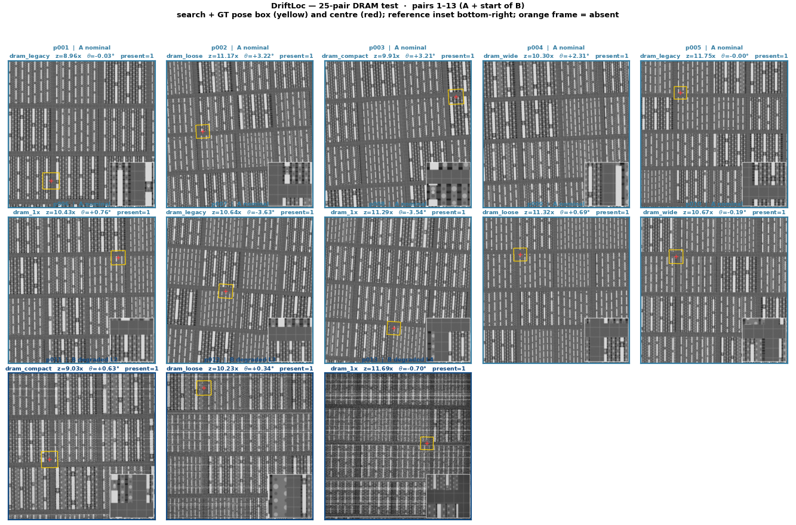
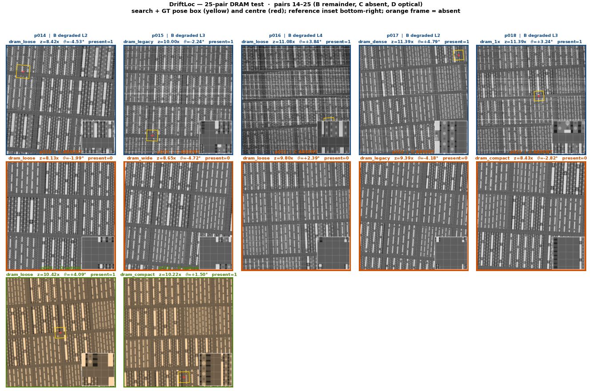

# DriftLoc — Semicon Phase 2. (Updated)

Pattern localisation for DRAM die images.  
Given a 100× reference crop and a 10× search image, find where the reference sits,
return its centre `(x, y)`, orientation `theta`, zoom `scale`, and a `found` flag
that says whether the reference is even present.


---

## Quick-start — how to test

### What you need

| File | Purpose |
|---|---|
| `register.py` | Entry point (the only script you run) |
| `localize.py` | Loads the model, runs inference |
| `train.py` | Pipeline core (proposals, verifier, refinement) |
| `model/verifier.pt` | Trained weights (ships in the ZIP) |
| `requirements.txt` | All dependencies |

---

## How to Test

### Step 1 — Get into the right folder

When you download the ZIP from GitHub it creates a nested folder.
You need to be inside the folder that contains `register.py`.

**Windows PowerShell:**
```powershell
cd "C:\Users\<you>\Downloads\Semicon-Submission-main"
cd ".\Semicon-Submission-main"
dir
```

You should see `register.py`, `localize.py`, `train.py`, `requirements.txt`, and a `model` folder.
If you do not see them, keep doing `cd <folder-name>` until you do.

---

### Step 2 — Create a virtual environment and install packages

**Windows PowerShell:**
```powershell
python -m venv .venv
.\.venv\Scripts\Activate.ps1
python -m pip install --upgrade pip
python -m pip install -r requirements.txt
```

**macOS / Linux:**
```bash
python3 -m venv .venv
source .venv/bin/activate
pip install --upgrade pip
pip install -r requirements.txt
```

You will see packages downloading. Wait until the prompt returns.
You only need to do this once per machine.

---

### Step 3 — Run on the test set

> ⚠️ The full command must be typed **on one line**. Do not split it with `\` in PowerShell.

**Windows PowerShell:**
```powershell
python register.py --input "C:\Users\<you>\Downloads\phase2_test_set\pairs.csv" --output predictions.csv
```

**macOS / Linux:**
```bash
python register.py --input /path/to/phase2_test_set/pairs.csv --output predictions.csv
```

When it finishes you will see:
```
wrote 450 rows -> predictions.csv
```

`predictions.csv` is saved in whichever folder your terminal is currently in,
unless you give a full path like `--output C:\Users\<you>\Desktop\predictions.csv`.

---

### Step 4 — What the output looks like

Open `predictions.csv` in Excel or any text editor:

```text
pair_id,x,y,theta,scale,found,score
p001,423.1200,318.7500,0.8700,9.9500,1,0.923411
p002,0.0000,0.0000,0.0000,0.0000,0,0.041200
```

| Column | Meaning |
|---|---|
| `x, y` | Match centre in the search image, subpixel, top-left origin |
| `theta` | Rotation in degrees, CCW positive |
| `scale` | Down-scaling factor, nominally 8–12 |
| `found` | 1 = reference is present and located, 0 = absent |
| `score` | Confidence (higher is more certain) |

- `found=1` → reference was located; `x y theta scale` are the result
- `found=0` → reference is absent in that image; pose columns are all 0
- One row per pair, same order as `pairs.csv`

---


## What we improved from Phase 1

Phase 1 solved the basic location problem: ZNCC proposals → CNN verifier → sub-pixel `(x, y)`.
Phase 2 keeps that core and layers on top everything the new contract requires.

| Area | Phase 1 | Phase 2 |
|---|---|---|
| Entry point | `localize.py` prints `x y` | `register.py` → `predictions.csv` |
| Output columns | `x, y` | `x, y, theta, scale, found, score` |
| Scale search range | 9.0–11.0 (5 steps) | **8.0–12.0 (9 steps, Δ0.5)** |
| Rotation search range | ±2° (5 steps) | **±5° (11 steps, Δ1°)** |
| Pose grid total | 25 ZNCC maps | **99 ZNCC maps** |
| Absent pairs | Not scored | **Uniqueness gate → `found` flag** |
| Pose output | Not required | Discrete grid + **local pose refinement** |
| Speed | Full multi-pose ZNCC | **Coarse-to-fine pruning** (half-res first) |
| Weights path | Relative to CWD | **Script-relative** `model/verifier.pt` (safe from any CWD) |

**Core idea unchanged:** ZNCC generates candidate locations at multiple scales and rotations →
the CNN verifier picks the best cell → sub-pixel refinement sharpens `(x, y)` →
local pose refinement sharpens `theta` and `scale` → uniqueness gate decides `found`.

---

## Score on the test set

Evaluated on a **25-pair DRAM-only** set from the part2 generator
(Set A 10, Set B 8, Set C 5, Set D 2).
<p>


</p>

**What these images mean.** Each tile is one contest pair: the full **search image**, with the **reference crop** inset at the bottom-right (that is the template `register.py` is given). These overlays are **ground truth**, not model output.

| Cue | Meaning |
|---|---|
| Yellow rotated box | Where the reference actually sits in the search image (GT pose) |
| Red cross | GT centre `(x, y)` |
| Orange frame, `present=0` | Set C **absent** — no true instance, no yellow box |
| Left sheet (p001–p013) | All 10 Set A (nominal) + first 3 Set B (degraded) |
| Right sheet (p014–p025) | Rest of Set B, all 5 Set C, both Set D (optical) |

Blue titles are present DRAM; orange is absent; green/brown is optical. The matcher must return `found=1` on A/B/D and `found=0` on the orange row.

### Rejection (`found` vs present/absent)

| Metric | Result |
|---|---|
| TP / FP / FN | **20 / 3 / 0** |
| F1 (`found`) | **0.930** |
| Precision / Recall | 0.87 / 1.00 |

All 20 present pairs were found. The three FPs are Set C same-architecture
decoys that look unique in that frame (agree + margin both fire).

### Localisation (20 present pairs)

Contest credit: ≤1 px → 1.00, ≤2 px → 0.80, ≤3 px → 0.60, ≤5 px → 0.40.
`found=0` on a present pair scores 0.

| | ≤1 px | ≤2 px | ≤3 px | ≤5 px |
|---|---:|---:|---:|---:|
| **p@k** | **0.800** (16/20) | **1.000** (20/20) | **1.000** | **1.000** |
| Set A (10) | 9/10 | 10/10 | 10/10 | 10/10 |
| Set B (8) | 5/8 | 8/8 | 8/8 | 8/8 |
| Set D (2) | 2/2 | 2/2 | 2/2 | 2/2 |

| Set | Mean credit | Median error |
|---|---:|---:|
| A | 0.980 | 0.45 px |
| B | 0.925 | 0.93 px |
| D | 1.000 | 0.52 px |
| **Overall** | **0.960** | — |

Set B p@1 is lower because collapse/low dose flatten the ZNCC peak and leave
~1 px of unmodeled shear/drift, not because the wrong cell is chosen. Nobody
is outside 2 px. Present peaks still overlap absent (min 0.386 vs max 0.549),
so a 0.55 height cut would reject true Set B pairs this gate keeps.

---

## Failures we hit and how we fixed them (Phase 2 updated)

Phase 1 already returned `(x, y)`. The **Phase 2 update** added `theta`, `scale`,
`found`, pose 8–12× / ±5°, and absent pairs. These are the failures from that
update. Same write-up: [`failure_analysis.pdf`](failure_analysis.pdf).

| # | Phase 2 failure | What we saw | Fix |
|---|---|---|---|
| 1 | Weights missing off CWD | Scorer runs from another folder → no `verifier.pt` → plain ZNCC | Load weights next to the script |
| 2 | One pair kills the run | Bad image raises; rest of `pairs.csv` never written | `try/except` per pair, `found=0` |
| 3 | DRAM lattice + narrow pose | Repeating streets; Phase 1 ±2° / 9–11× missed tilt/zoom | Search ±5° / 8–12×, CNN still ranks peaks |
| 4 | 99-map runtime | Full-res ZNCC on 99 poses &gt; 5 s | Half-res prune, then full-res on top-3 |
| 5 | `found` from peak ≥ 0.55 | Set B peaks ~0.36 but site is right; absents can still peak high | Uniqueness: agree ≤ 3 px **and** margin ≥ 0.05 |

**1. Verifier weights not found when run from a different folder**  
The original code looked for `model/verifier.pt` relative to where you *run* the script.
If the organiser's scorer runs from a parent directory, the weights silently disappear
and every pair falls back to plain ZNCC (much worse accuracy).
Fix: `localize.py` now resolves the weights relative to its own file path, not the CWD.

**2. One bad pair crashed the whole run**  
If a single image was unreadable (bad path, truncated file), Python would raise
an exception and all remaining pairs would produce no output — a missing row scores zero,
so this could silently lose hundreds of pairs.
Fix: `register.py` wraps every pair in a `try/except`. A failed pair writes `found=0`
and processing continues.

**3. DRAM lattice ambiguity**  
DRAM dies have highly periodic patterns. ZNCC produces many equally-strong peaks
at the wrong lattice repeat positions. Phase 1 already used a CNN verifier with hard
negatives for this, but the narrow pose range (±2°, 9–11×) missed pairs where
the chip was tilted or zoomed further out.
Fix: Widened the search to ±5° and 8–12× with a coarse-to-fine strategy so runtime
stays under 1 s even with 99 pose maps.

**4. Runtime blowup with wider pose grid**  
Going from 25 to 99 full-resolution ZNCC maps pushed time per pair above the 5 s budget.
Fix: Run ZNCC at half resolution first, keep only the top-scoring `(scale, theta)` candidates,
then run full-resolution ZNCC only on those. Median time dropped from ~2.1 s to ~0.57 s.

**5. `found` from peak ≥ 0.55 fails on degraded (Set B) data**  
Organizers publish “rejection F1 @ 0.55” as a *naive-baseline calibration*, not as
the contest rule for `found`. On this type of SEM, severity 3–4 (low dose, collapse)
crushes ZNCC **height** (peaks ~0.36) while the **site stays** (~1–2 px). A 0.55 cut
then false-rejects true pairs. Absent DRAM decoys can still peak above 0.55, so the
same cut false-accepts. Height present/absent overlap on the 25-pair DRAM set was
**−0.163** (present min 0.386, absent max 0.549).
Fix: decide `found` from **uniqueness on this image only**, not from peak height
and not from other references:

```text
found = 1  iff  intensity and edge peaks agree (≤ 3 px)
                AND  (peak − runner-up) ≥ 0.05
```

On the 25 DRAM pairs that gate is TP=20 FP=3 FN=0 (F1 **0.930**), overall loc
credit **0.960**, p@2 **1.000**. Remaining Phase 2 FPs are unique same-arch streets
in Set C (`p019`–`p023`) — a one-pair matcher cannot prove identity, and we do not
add extra templates or dataset-specific cuts to chase them.

---

## Method summary

```
pairs.csv
   │
   ▼
ZNCC at 9 (scale, theta) coarse candidates          ← half-res, fast
   │  prune to top-3 candidates
   ▼
ZNCC at full resolution for selected candidates
   │  top-K peak locations per map
   ▼
CNN Verifier (model/verifier.pt)                    ← ranks all peaks
   │  picks best (x, y, scale, theta)
   ▼
Sub-pixel refinement (parabolic fit)
   │
   ▼
Local pose refinement (gradient search around best peak)
   │
   ▼
Uniqueness gate (agree ≤ 3 px AND margin ≥ 0.05)  →  found=1 or found=0
   │
   ▼
predictions.csv
```

Weights ship in `model/verifier.pt` — nothing is downloaded at run time.
